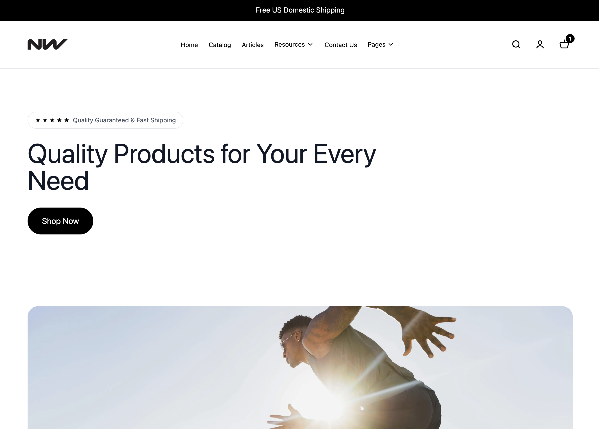

# Next.js WooCommerce with Faust.js

A modern headless e-commerce solution built with Next.js, WooCommerce, and Faust.js. This project provides a fully functional online store with authentication, cart management, checkout, and payment processing.



## 🚀 Features

- **Headless Architecture**: Next.js frontend with WordPress/WooCommerce backend
- **Faust.js Integration**: Seamless WordPress authentication and content management
- **WooCommerce Integration**: Full e-commerce functionality via GraphQL
- **User Authentication**: Login, registration, and account management
- **Shopping Cart**: Persistent cart with session management
- **Checkout Flow**: Complete checkout with billing, shipping, and payment processing ⚠️ **Note: Checkout functionality is currently under review and may require fixes**
- **Stripe Integration**: Secure payment processing with Stripe Elements
- **Product Catalog**: Product listings, categories, and search
- **User Accounts**: Order history, account details, and address management
- **Responsive Design**: Mobile-first, modern UI built with Tailwind CSS

## 📋 Prerequisites

Before you begin, ensure you have the following installed:

- **Node.js** 20.x or higher
- **npm** or **yarn** package manager
- **WordPress** site (5.8 or higher)
- **PHP** 7.4 or higher (for WordPress)
- **MySQL** 5.7 or higher (for WordPress database)

## 🛠️ Installation

### Step 1: Clone the Repository

```bash
git clone <repository-url>
cd nw-nextjs-faust-woocommerce
```

### Step 2: Install Next.js Dependencies

```bash
npm install
```

### Step 3: Configure Environment Variables

Create a `.env.local` file in the root directory:

```bash
cp .env.example .env.local  # If you have an example file
# Or create .env.local manually
```

Add the following environment variables:

```env
# Required: Your WordPress GraphQL endpoint
NEXT_PUBLIC_GRAPHQL_URL=http://localhost:8080/graphql

# Faust.js Configuration
# Your WordPress site URL (base URL, not the GraphQL endpoint)
NEXT_PUBLIC_WORDPRESS_URL=http://localhost:8080

# Plugin secret found in WordPress Settings->Faust
FAUST_SECRET_KEY=your-faust-secret-key-here

# Optional: Algolia Search (only if using search)
# NEXT_PUBLIC_ALGOLIA_APP_ID=your_algolia_app_id
# NEXT_PUBLIC_ALGOLIA_PUBLIC_API_KEY=your_algolia_public_key
# NEXT_PUBLIC_ALGOLIA_INDEX_NAME=your_index_name

# Optional: Placeholder images
NEXT_PUBLIC_PLACEHOLDER_SMALL_IMAGE_URL=https://via.placeholder.com/300
NEXT_PUBLIC_PLACEHOLDER_LARGE_IMAGE_URL=https://via.placeholder.com/800

# Stripe Configuration
# Publishable key - safe to use in frontend/client-side code
NEXT_PUBLIC_STRIPE_PUBLISHABLE_KEY=pk_test_...

# Stripe Gateway ID - usually 'stripe' but check your WooCommerce Stripe plugin settings
# Common values: 'stripe', 'stripe_cc', 'woocommerce_gateway_stripe'
NEXT_PUBLIC_STRIPE_GATEWAY_ID=stripe

# NOTE: The Stripe SECRET key (sk_test_...) should NOT be added here!
# Secret keys must only be stored in your WordPress/WooCommerce backend (server-side)
# Add the secret key in your WordPress admin: WooCommerce > Settings > Payments > Stripe
```

### Step 4: Start Development Server

```bash
npm run dev
```

The application will be available at `http://localhost:3000`

## 🔌 WordPress Backend Setup

### Required WordPress Plugins

Install and activate the following plugins in your WordPress site:

#### Core Plugins (Required)

1. **[WooCommerce](https://wordpress.org/plugins/woocommerce/)**
   - E-commerce platform for WordPress
   - Install via: Plugins → Add New → Search "WooCommerce"

2. **[WP GraphQL](https://wordpress.org/plugins/wp-graphql/)**
   - Exposes GraphQL API for WordPress
   - Install via: Plugins → Add New → Search "WPGraphQL"
   - **Important**: After activation, note your GraphQL endpoint URL (usually `/graphql`)

3. **[WP GraphQL WooCommerce](https://github.com/wp-graphql/wp-graphql-woocommerce)**
   - Adds WooCommerce functionality to WPGraphQL schema
   - Install via: Download from GitHub → Plugins → Add New → Upload Plugin
   - Download: https://github.com/wp-graphql/wp-graphql-woocommerce/releases

4. **[WP GraphQL CORS](https://wordpress.org/plugins/wp-graphql-cors/)**
   - Enables CORS for GraphQL requests
   - Install via: Plugins → Add New → Search "WPGraphQL CORS"
   - **Configuration**: After activation, configure CORS settings to allow your Next.js domain

5. **[Faust.js WordPress Plugin](https://wordpress.org/plugins/faustwp/)**
   - Provides authentication and API endpoints for Faust.js
   - Install via: Plugins → Add New → Search "Faust"
   - **Configuration**: 
     - Go to Settings → Faust
     - Copy the "Secret Key" and add it to your `.env.local` as `FAUST_SECRET_KEY`
     - Set "Frontend URL" to your Next.js app URL (e.g., `http://localhost:3000`)

#### Optional Plugins

6. **[WPGraphQL Content Blocks](https://github.com/wpengine/wp-graphql-content-blocks)**
   - Enables Gutenberg block support in GraphQL
   - Required if you want to use WordPress blocks in your Next.js app
   - See [WPGraphQL_CONTENT_BLOCKS_INSTALL.md](./WPGraphQL_CONTENT_BLOCKS_INSTALL.md) for installation

7. **[Advanced Custom Fields (ACF)](https://www.advancedcustomfields.com/)**
   - For custom product fields
   - Install via: Plugins → Add New → Search "Advanced Custom Fields"
   - See [WORDPRESS_CUSTOM_FIELDS_SETUP.md](./WORDPRESS_CUSTOM_FIELDS_SETUP.md) for setup

8. **[WPGraphQL for Advanced Custom Fields](https://wordpress.org/plugins/wp-graphql-acf/)**
   - Exposes ACF fields to GraphQL (required if using ACF)
   - Install via: Plugins → Add New → Search "WPGraphQL ACF"

9. **[WooCommerce Stripe Payment Gateway](https://woocommerce.com/products/stripe/)**
   - Required for Stripe payment processing
   - Install via: WooCommerce → Settings → Payments → Stripe → Set up
   - **Configuration**: Add your Stripe API keys (Secret key goes here, not in Next.js)

### WordPress Configuration Steps

1. **Configure WooCommerce**
   - Go to WooCommerce → Settings
   - Complete the setup wizard:
     - Store details (address, currency, etc.)
     - Payment methods (enable Stripe)
     - Shipping options
   - Add some test products

2. **Configure WP GraphQL CORS**
   - Go to Settings → GraphQL CORS (or GraphQL → Settings)
   - Add your Next.js frontend URL to allowed origins
   - Example: `http://localhost:3000` (for development)
   - For production: `https://your-domain.com`

3. **Configure Faust.js**
   - Go to Settings → Faust
   - Set "Frontend URL" to your Next.js app URL
   - Copy the "Secret Key" to your `.env.local` file
   - Enable "Enable Redirects" if you want WordPress to redirect to your Next.js frontend

4. **Test GraphQL Endpoint**
   - Visit `http://your-wordpress-site.com/graphql`
   - You should see a GraphQL interface or endpoint
   - Test a simple query:
     ```graphql
     {
       products(first: 5) {
         nodes {
           id
           name
           price
         }
       }
     }
     ```

## 📦 Dependencies

### Core Dependencies

- **Next.js** `16.0.7` - React framework for production
- **React** `19.2.1` - UI library
- **TypeScript** `5.9.3` - Type safety
- **Apollo Client** `^3.14.0` - GraphQL client
- **Faust.js** `^3.3.4` - WordPress integration framework
  - `@faustwp/core` - Core Faust.js functionality
  - `@faustwp/blocks` - WordPress block rendering
  - `@faustwp/cli` - CLI tools

### E-commerce Dependencies

- **Stripe** - Payment processing
  - `@stripe/stripe-js` `^4.0.0` - Stripe.js SDK
  - `@stripe/react-stripe-js` `^2.9.0` - React components for Stripe

### UI & Styling

- **Tailwind CSS** `^3.4.18` - Utility-first CSS framework
- **Lucide React** `^0.555.0` - Icon library
- **Motion** `^12.23.25` - Animation library

### Form Management

- **React Hook Form** `^7.68.0` - Form state management and validation

### State Management

- **Zustand** `^5.0.9` - Lightweight state management (for cart)

### Search (Optional)

- **Algolia Search** - If using Algolia search
  - `algoliasearch` `^4.25.3`
  - `react-instantsearch-dom` `^6.40.4`

### Development Dependencies

- **ESLint** - Code linting
- **Prettier** `^3.7.4` - Code formatting
- **TypeScript** - Type checking
- **Playwright** `^1.57.0` - E2E testing
- **Lighthouse CI** `^0.15.1` - Performance monitoring

## 🚀 Development

### Available Scripts

```bash
# Start development server
npm run dev

# Build for production
npm run build

# Start production server
npm start

# Run linter
npm run lint

# Format code
npm run format

# Run Playwright tests
npm run playwright

# Run Playwright UI
npm run playwright:ui

# Run Lighthouse CI
npm run lhci
```

### Project Structure

```
nw-nextjs-faust-woocommerce/
├── src/
│   ├── components/          # React components
│   │   ├── Checkout/       # Checkout flow components
│   │   ├── Cart/           # Shopping cart components
│   │   ├── Product/        # Product display components
│   │   └── User/           # User account components
│   ├── pages/              # Next.js pages
│   │   ├── checkout.tsx    # Checkout page
│   │   ├── cart.tsx        # Cart page
│   │   ├── account.tsx     # Account page
│   │   └── [...slug].tsx   # Dynamic WordPress pages
│   ├── utils/              # Utility functions
│   │   ├── apollo/         # Apollo Client configuration
│   │   ├── gql/            # GraphQL queries and mutations
│   │   └── auth.ts         # Authentication utilities
│   ├── stores/             # State management (Zustand)
│   └── faust.config.js     # Faust.js configuration
├── public/                 # Static assets
├── .env.local             # Environment variables (not in git)
└── package.json          # Dependencies and scripts
```

## 🔐 Authentication

This project uses **Faust.js** for WordPress authentication. The authentication flow:

1. User logs in via `useLogin()` hook from `@faustwp/core`
2. Faust.js handles the authorization code flow
3. Access tokens are stored securely
4. Authenticated requests use `getApolloAuthClient()` which automatically includes auth headers

### Key Authentication Components

- **CheckoutLogin**: Login component for checkout page
- **Account Page**: Full account management with authentication
- **useAuth Hook**: Checks authentication status throughout the app

## 💳 Payment Processing

Stripe integration is configured for secure payment processing:

1. **Frontend**: Uses Stripe Elements for card input
2. **Backend**: WooCommerce Stripe plugin processes payments
3. **Configuration**: 
   - Publishable key in `.env.local` (frontend)
   - Secret key in WordPress WooCommerce settings (backend)

See [STRIPE_ENV_VARIABLES_EXPLAINED.md](./STRIPE_ENV_VARIABLES_EXPLAINED.md) for detailed Stripe setup.

## ⚠️ Known Issues

### Checkout Functionality

**Status**: Under Review

The checkout flow is currently being reviewed and may have issues with:
- User authentication during checkout
- Order assignment to logged-in users
- Billing and shipping data population

**Workaround**: If you encounter issues:
1. Ensure you're logged in before adding items to cart
2. Visit the account page first to establish authentication session
3. Then proceed to checkout

**Note**: The checkout components have been refactored to use Faust.js authentication, but additional testing and fixes may be required.

## 🐛 Troubleshooting

### Common Issues

#### "Sorry, no session found" Error

- **Cause**: Authentication session not initialized
- **Solution**: Ensure `useAuth()` is called in components that need authentication
- **Fix**: The checkout page now initializes auth automatically

#### GraphQL Connection Errors

- **Check**: `NEXT_PUBLIC_GRAPHQL_URL` is correct in `.env.local`
- **Verify**: WordPress GraphQL endpoint is accessible
- **Test**: Visit `http://your-wordpress-site.com/graphql` in browser

#### CORS Errors

- **Check**: WP GraphQL CORS plugin is installed and configured
- **Verify**: Your Next.js URL is added to allowed origins
- **Test**: Check browser console for specific CORS error messages

#### Orders Assigned to Guest

- **Cause**: Checkout mutation not using authenticated client
- **Solution**: Ensure `getApolloAuthClient()` is used for checkout mutations
- **Status**: ✅ Fixed in latest version

#### User Data Not Loading After Login

- **Cause**: Apollo cache not refreshing after authentication
- **Solution**: Faust.js handles this automatically, but ensure `useAuth()` is called
- **Fix**: Components now use authenticated Apollo client

### Debug Mode

Enable debug logging by checking browser console. The app includes extensive logging for:
- Authentication flow
- GraphQL queries and mutations
- Cart operations
- Checkout process

## 📚 Additional Documentation

- [WordPress Blocks Setup](./WORDPRESS_BLOCKS_SETUP.md) - Setting up WordPress blocks
- [WordPress Custom Fields Setup](./WORDPRESS_CUSTOM_FIELDS_SETUP.md) - ACF configuration
- [WPGraphQL Content Blocks Install](./WPGraphQL_CONTENT_BLOCKS_INSTALL.md) - Block plugin setup
- [Stripe Environment Variables](./STRIPE_ENV_VARIABLES_EXPLAINED.md) - Stripe configuration guide

## 🤝 Contributing

Please read [CONTRIBUTING.md](./CONTRIBUTING.md) for details on our code of conduct and the process for submitting pull requests.

## 📄 License

This project is licensed under the ISC License - see the [LICENSE](./LICENSE) file for details.

## 🙏 Acknowledgments

- [Faust.js](https://faustjs.org/) - WordPress headless framework
- [WooCommerce](https://woocommerce.com/) - E-commerce platform
- [WPGraphQL](https://www.wpgraphql.com/) - GraphQL API for WordPress
- [Next.js](https://nextjs.org/) - React framework
